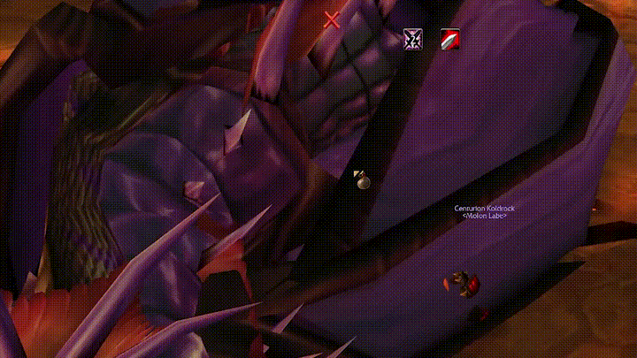
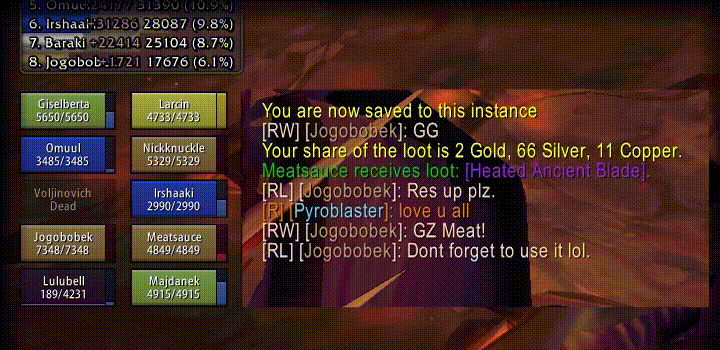
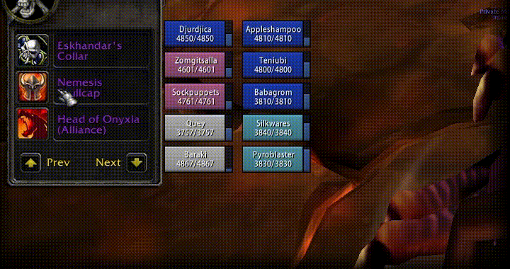
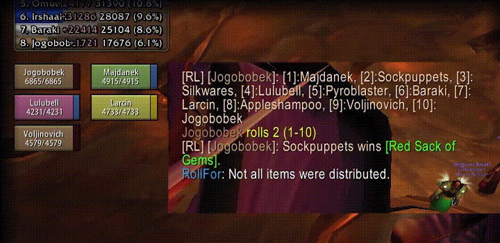
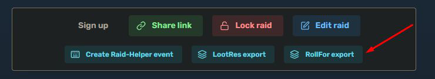
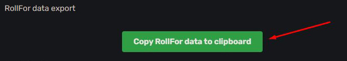
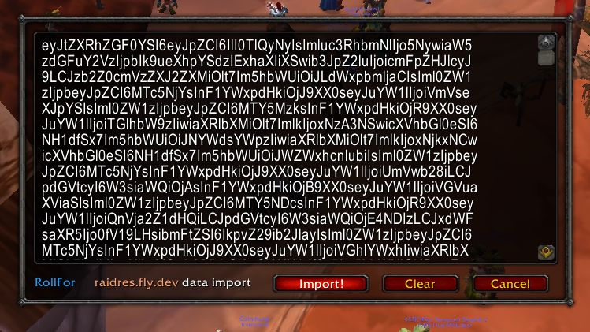

# RollFor
A World of Warcraft (1.12.1) addon that manages rolling for items.  

## Demo

### Overview

In this example, the addon shows the soft-ressed items in the loot list.  
The Master Looter raid-rolls the trash item, then rolls non-SR items.  
Then the SR items are rolled.


### Tie roll

In this example, the addon automatically detects that the item is soft-reserved by two players.  
It restricts rolling for the item to these players only and resolves any tie automatically.  
The Master Looter then assigns the item directly to the winner.


## Features

### Fully SR-integrated loot list


---

### Automatically enables Master Loot when a boss is targeted
Disable this feature with:  
```
/rf config auto-master-loot
```

---

### Shows the loot that dropped (and who soft reserved)


---

### Makes Master Loot window pretty and safe
* one window with players sorted by class
* adds confirmation window



---

### Fully automated
 * Detects if someone rolls too many times and ignores extra rolls.
 * If multiple players roll the same number, it automatically shows it and
   waits for these players to re-roll.


---

### Soft res integration
 * Integrates with https://raidres.fly.dev.
 * Minimap icon shows soft res status and who did not soft res.
 * Fully automated (shows who soft ressed, only accepts rolls from players who SR).

---

### And more
 * Supports "**two top rolls win**" rolling.
 * Supports **raid rolls**.
 * Supports offspec rolls (`/roll 99`).
 * Supports transmog rolls (`/roll 98`).
 * Automatically resolves tied rolls.
 * Highly customizable - see `/rf config` and `/rf config help`.



---

### See it in action
https://youtu.be/vZdafun0nYo


## Usage

### Roll item
```
/rf <item link>
```

---

### Raid-roll item from your bags
```
/rr <item link>
```

---

### Insta Raid-roll item from your bags
```
/irr <item link>
```

---

### Roll for 2 items (two top rolls win)
```
/rf 2x<item link>
```

---


### Ignore SR and allow everyone to roll
If the item is SRed, the addon will only watch rolls for players who SRed.
However, if you want everyone to roll, even if the item is SRed, use `/arf`
instead of `/rf`. "arf" stands for "All Roll For".

---


## Soft-Res setup

1. Create a Soft Res list at https://raidres.fly.dev.  
2. Ask raiders to add their items.
3. When ready, lock the raid and click on **RollFor export** button.



4. Click on **Copy RollFor data to clipboard** buton.



5. Click on the minimap icon or type `/sr`.  
6. Paste the data into the window.  
7. Click **Import!**.  



The addon will tell you the status of SR import.  
Hovering over the minimap icon will tell you who did not soft-res.  

The minimap icon will be **green** if everyone in the group is soft-ressing.  
The minimap icon will be **orange** if someone has not soft-ressed.  
The minimap icon will be **red** if you have an outdated soft-res data.  
The minimap icon will be **white** if there is no soft-res data.  

To show the SR items type:
```
/srs
```

If someone needs to update their items, repeat the process and copy the data again.


### Soft-Res data format

The SR data from *Raidres* is a **Base64** encoded **JSON**. Decode it to see what's inside.  

---


### Fixing mistyped player names in SR setup

When using soft-res, the players sometimes mistype their nickname, e.g. 
`Johnny` in game will be `Jonnhy` in the raidres.fly.dev website.  
The addon is smart enough to fix simple typos like that for you.  
It will also deal with special characters in player names.  
However, sometimes there's so many typos and the addon can't match the  
player's name - you have to fix it manually.  

`/sro` (stands for SR Override) is the command to do this.  

---


### Finish rolls early
```
/fr
```

---


### Cancel rolls
```
/cr
```

---


### Show soft-ressed items
```
/srs
```

---


### Check soft-res status (to see if everyone is soft-ressing)
```
/src
```

---


### Clear soft-res data
Click on the minimap icon and click **Clear** or type:  
```
/sr init
```

---


## Shoutouts

Thank you to:
  * **Turtle WoW devs** for amazing content. You cunts should switch to a better client.  
  * **Itamedruids** for *Raidres* and adding the export function. Love your work.  
  * My fellow raiders (there's too many to mention).  
  * All bug reporters, testers and feature suggesters.  


## Need more help?

The best way to contact me is to message me on Discord.  
Username: **Obszczymucha**  

My character **Jogobobek** will no longer be available on Turtle WoW.  
I'm switching to Netherwing 3.0, perhaps under a different name :P  

Thanks Turtle for fun.

